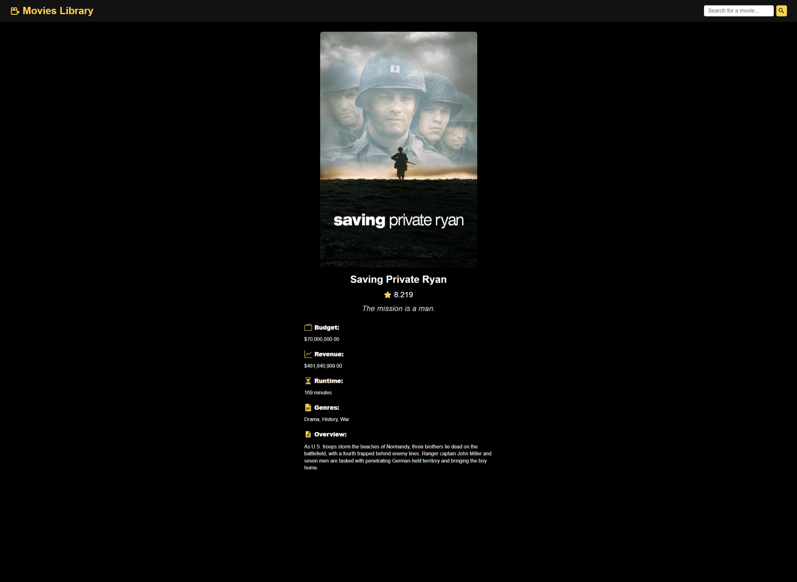

# Movies Library

A simple React project to browse and search for movies. Built with Vite for fast development and modern tooling.




## Features

- Search for movies by title
- View detailed information about each movie
- Responsive design for desktop and mobile
- Clean and minimal UI

## Technologies Used

- [React](https://react.dev/)
- [Vite](https://vitejs.dev/)
- [TMDb API](https://www.themoviedb.org/documentation/api) for movie data

## Getting Started

1. **Install dependencies:**
    ```bash
    npm install
    ```
2. **Start the development server:**
    ```bash
    npm run dev
    ```
3. **Open your browser:**  
    Visit [http://localhost:5173](http://localhost:5173) to view the app.

## Customization

- Update API keys or endpoints in the configuration files as needed.
- Style the app by editing the CSS files in the `src` directory.

## Contributing

Feel free to open issues or submit pull requests to improve the project!

## License

This project is licensed under the MIT License.
