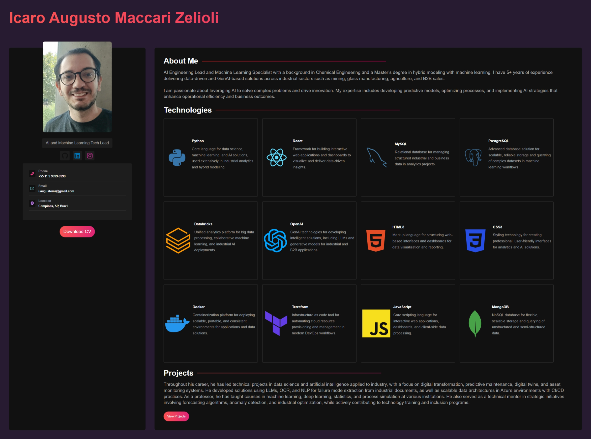

# Portfolio Project

This is a personal portfolio project built with [React](https://react.dev/), [Vite](https://vitejs.dev/), and SASS. The project demonstrates modern React development practices, fast development workflow, and advanced styling using SASS.



## Features

- ⚡️ Fast development with Vite
- 🔥 Hot Module Replacement (HMR)
- 🎨 SASS integration for advanced styling
- 🖌️ Customizable portfolio sections

## Getting Started

1. **Install dependencies:**
    ```bash
    npm install
    ```
2. **Start the development server:**
    ```bash
    npm run dev
    ```
3. **Build for production:**
    ```bash
    npm run build
    ```

## Plugins Used

- [@vitejs/plugin-react](https://github.com/vitejs/vite-plugin-react/blob/main/packages/plugin-react) (Babel-based Fast Refresh)
- [@vitejs/plugin-react-swc](https://github.com/vitejs/vite-plugin-react/blob/main/packages/plugin-react-swc) (SWC-based Fast Refresh)
- [SASS](https://sass-lang.com/) (CSS preprocessor)

## Customization

Feel free to modify and expand the portfolio sections to showcase your skills, projects, and experience. You can also customize styles using SASS for a unique look.

## License

This project is open source and available under the [MIT License](LICENSE).
