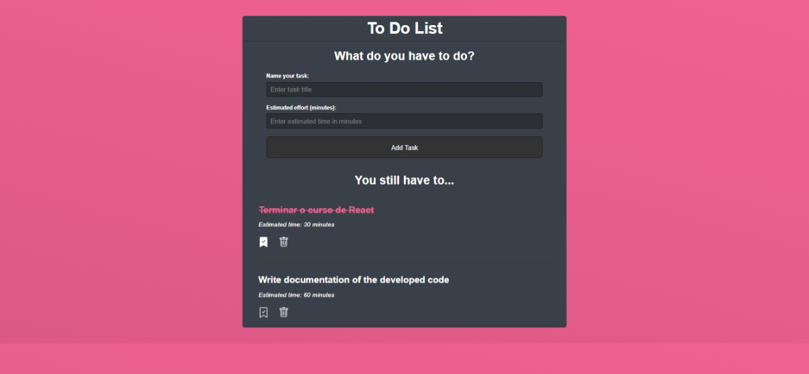
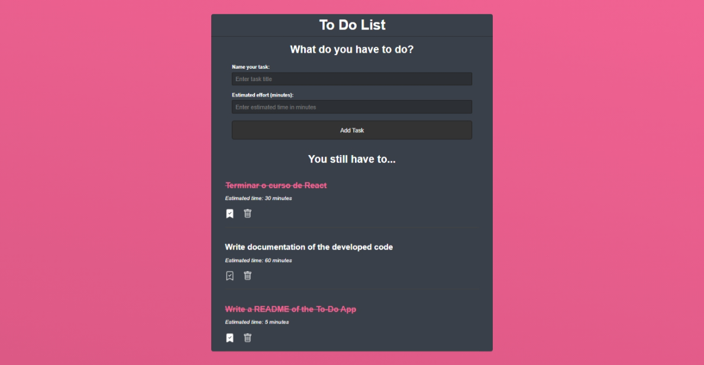

# To Do List App

A simple ReactJS To Do List application with CRUD operations, using a REST API backend.





## Features

- Add new tasks with a title and estimated time.
- Mark tasks as done/undone.
- Delete tasks.
- Tasks are persisted via a backend API.

## Getting Started

### Prerequisites

- Node.js and npm installed
- Backend API running at `http://localhost:5000` (e.g., [json-server](https://github.com/typicode/json-server))

### Installation

1. Clone the repository:

    ```bash
    git clone <your-repo-url>
    cd todolistapp
    ```

2. Install dependencies:

    ```bash
    npm install
    ```

3. Start the development server:

    ```bash
    npm start
    ```

    The app will be available at [http://localhost:3000](http://localhost:3000).

### Backend Setup

If you don't have a backend, you can use `json-server`:

```bash
npm install -g json-server
json-server --watch db.json --port 5000
```

Create a `db.json` file with:

```json
{
  "todos": []
}
```

## Usage

- Fill in the task title and estimated time, then click **Add Task**.
- Click the bookmark icon to mark a task as done/undone.
- Click the trash icon to delete a task.

## Technologies Used

- ReactJS
- REST API (json-server or your own backend)
- [react-icons](https://react-icons.github.io/react-icons/)

## License

This project is open source and available under the [MIT License](LICENSE).
